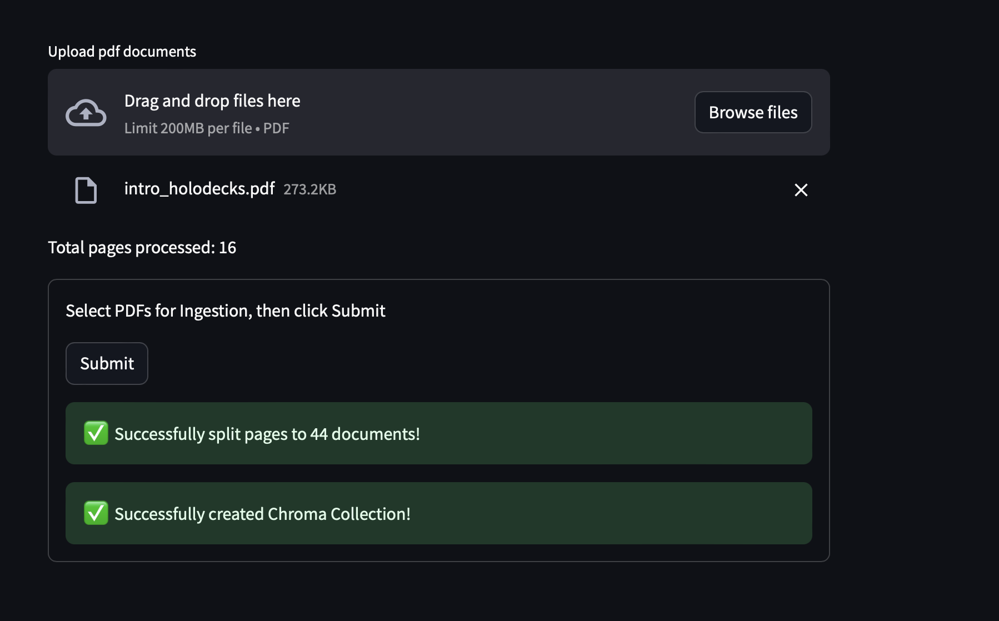
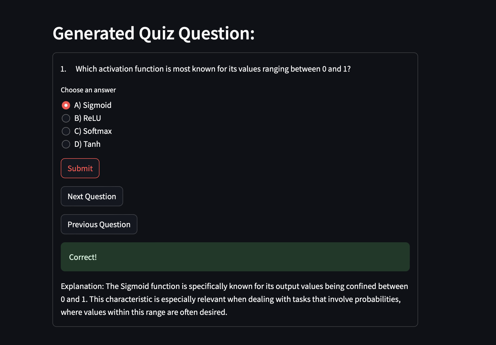

# Quiz Generator

## Overview

The Quiz Generator is an AI-powered tool designed to create quizzes based on the content of uploaded PDF documents. Leveraging advanced AI models and a streamlined user interface, this application makes it easy to generate and take quizzes on any provided material.

## Key Features

### PDF Processing
- **Easy Uploads**: Users can upload multiple PDF documents using intuitive Streamlit widgets.
- **AI Embedding**: The content from the uploaded PDFs is embedded into a vector store using Google's VertexAI embedding model and Gemini as the LLM (Language Learning Model).

### Interactive User Interface
- **Minimalist Design**: The application features a clean, easy-to-navigate interface.
- **Instant Feedback**: Users receive immediate feedback on their quiz responses, enhancing the learning experience.

## Technology Stack
- **Language Model**: Google's VertexAI embedding model and Gemini.
- **Vector Store**: ChromaDB.
- **Frontend**: Streamlit.

## Getting Started

To run the application, use the following command:

```python
streamlit run main.py
```

### Sample outputs


<p style="text-align: center;">pdf processing page</p>


<p style="text-align: center;">Quiz and user feedback page</p>

